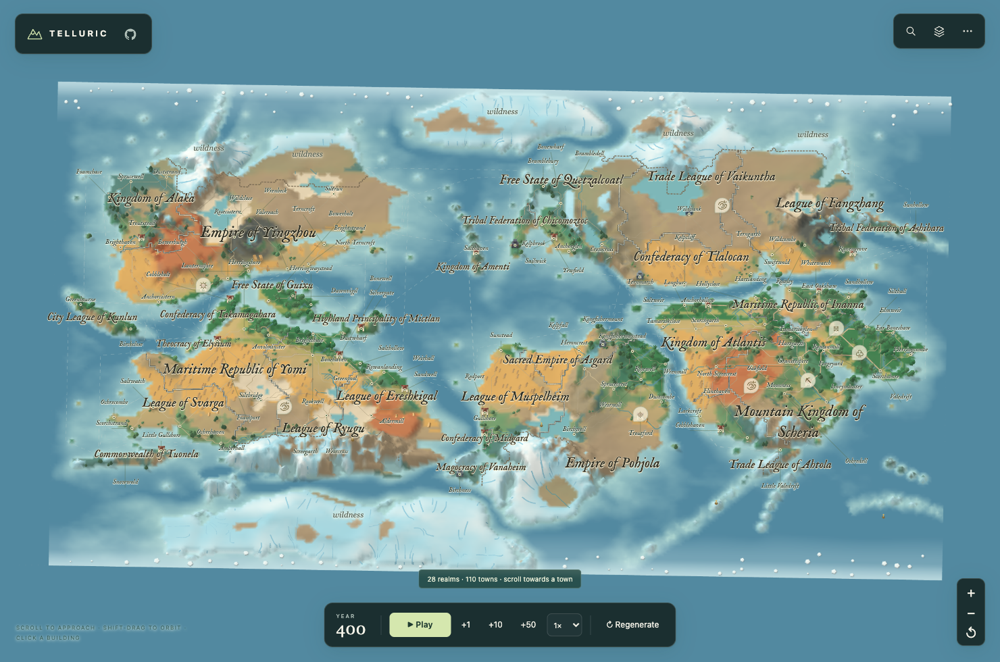
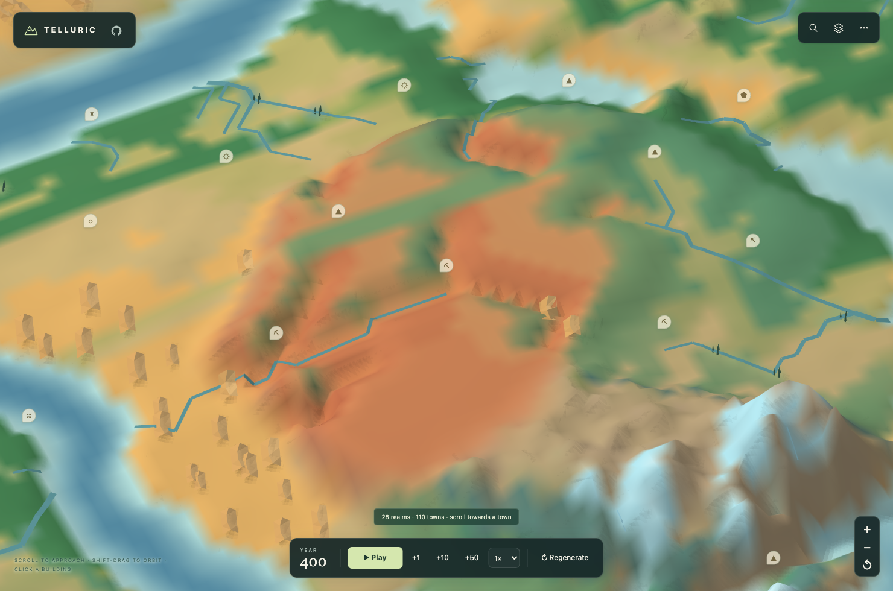
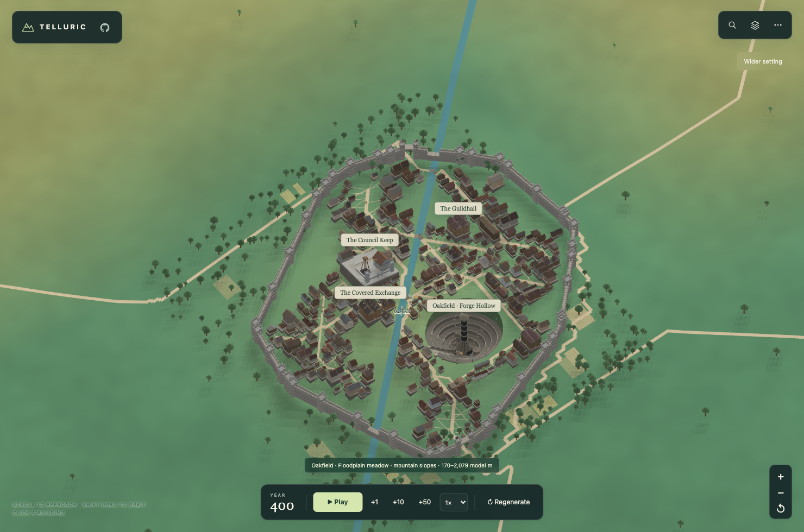
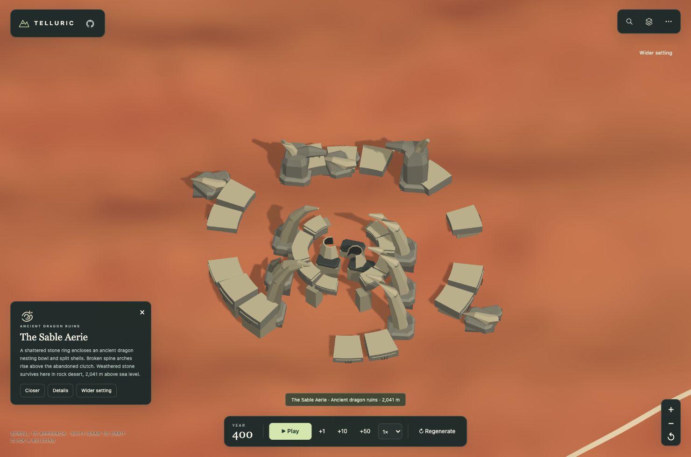

<picture>
  <source media="(prefers-color-scheme: dark)" srcset="assets/brand/telluric-wordmark-dark.svg">
  
</picture>

A procedural fantasy atlas you can explore from continents to city streets. Generate a world, discover its countries and people, and watch its history unfold—all in your browser.

**[Explore online](https://haofeiyu.me/telluric/)** · [中文说明](README.zh-CN.md)



*The default world, Aereth-47. Click a country name to see its territory, population and history. Countries print their full formal names. Domestic lakes belong to their surrounding countries; open wildness remains clearly marked.*

## Start exploring

| What you want to do | Control |
| --- | --- |
| Zoom from the world into a town | Scroll, pinch, or use **+ / −** |
| Move or rotate the view | Drag to pan; **Shift + drag** or right-drag to orbit |
| Find a place | Open **Search** or press **/**; choose **Zoom ↗** to approach a town |
| Inspect a country or building | Click its name, marker or building; hover a country name to highlight its borders |
| Return to the world | Click the top-left **TELLURIC** logo or press **H**; **Wider setting** pulls back from a town |

Use **Play** or the year-step buttons to advance history. **Regenerate** creates a new world from a seed and your settings. The **⋯** menu includes save/load, the chronicle and exports; save your world before replacing it.

## A world with distinct landforms



*Red tablelands and canyon walls. Tree, town and border layers are switched off to show the terrain.*

Explore red-rock mesas, basalt calderas, irregular mountain massifs, branching ridges and limestone towers. Their slopes change the rivers, climate and places people can settle. Plate compression shapes the uplands; seasonal winds carry ocean heat and moisture inland. Wet slopes retain forests and meadows, dry highlands keep their earth colours, and exposed cliffs and ice have distinct surfaces.

Search for a named landform to find it. Regenerate to explore the new terrain; old saves retain their original geography and history. [See the landform guide](docs/FANTASY_LANDFORMS.md) and [tectonics, climate and colour comparisons](docs/TECTONICS_AND_LANDCOVER.md).

## Cities belong to the landscape



*Oakfield: homes and streets surround the city's landmarks, with fields and water just beyond its walls.*

Zooming reveals buildings, walls, temples, palaces and waterfronts in the same landscape. Nearby terrain gains finer detail, and climate shapes the ground, vegetation and architecture. Click a building to inspect it; its **Details** panel also exports the town as a 3D model (GLB), excluding the surrounding terrain.

City detail loads as you approach. Initial generation and large cities can take longer on slower devices. Terrain and buildings use stylized scales.

### High cities and dragon relics

A coiled dragon totem marks a Dragon King Citadel; a sacred sun seal marks a High Holy City. These tiny settlements can appear where mountain platforms above 3,500 m have enough space, water and residents. A broken dragon totem marks ancient ruins: shattered nesting courts, dragon-spine arches and horned gateways.

Click a special symbol or open Search to visit. Searches for **龙城**, **圣城** and **龙族遗迹** work too. Ruins can be explored part by part and exported as a 3D model. [Explore the dragon sites](docs/DRAGON_SITES.md).



## People, countries and stories


*Wengar Brendis introduces Scorchspire. Each story chapter includes the world or historical facts behind it.*

Seven peoples inhabit the atlas. New countries form around a majority people while retaining minority communities; migration and political events can change that mix. Names draw on mythological traditions, and national overviews explain their origins.

Select a town and choose **Hear the whole story** to meet its narrator. Explore founding stories, recorded conflicts and local landmarks, including legendary places chosen from the world's geography.

## Run locally

Download or clone this repository, then open **[dist/telluric-onemap.html](dist/telluric-onemap.html)** in a modern browser. The standalone file works offline, with no account, API key or external asset downloads.

For development, use **Node.js 20+**. No npm dependencies need installing:

```bash
npm run dev
```

Open **http://127.0.0.1:5173**. After changing source, rebuild the offline HTML and its worker:

```bash
npm run build
npm test
```

New generation rules apply when you regenerate; loading an old save preserves its existing history.

## Learn more

- [Countries and population](docs/POLITIES.md) · [Borders and wildness](docs/LAKE_TERRITORY_AND_LABELS.md) · [Mythological names](docs/REALM_NAMES.md)
- [Cities and terrain](docs/CITY_COHERENCE.md) · [Climate and landscapes](docs/BIOME_LANDSCAPES.md)
- [Resident stories](docs/CITY_SAGAS.md) · [Architecture gallery and GLB exports](docs/WONDER_REFINEMENT.md)
- [Loading performance](docs/MAP_LOADING.md) · [Map architecture](docs/CONTINUOUS_ARCHITECTURE.md)
