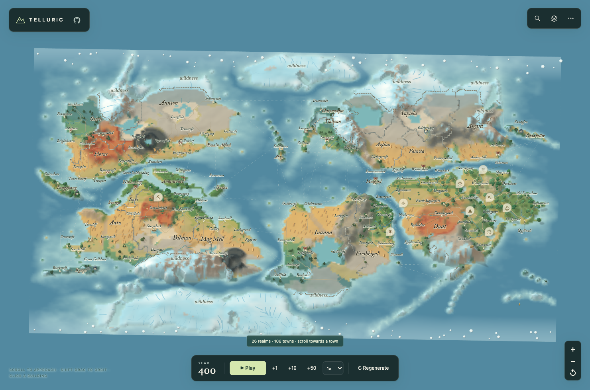
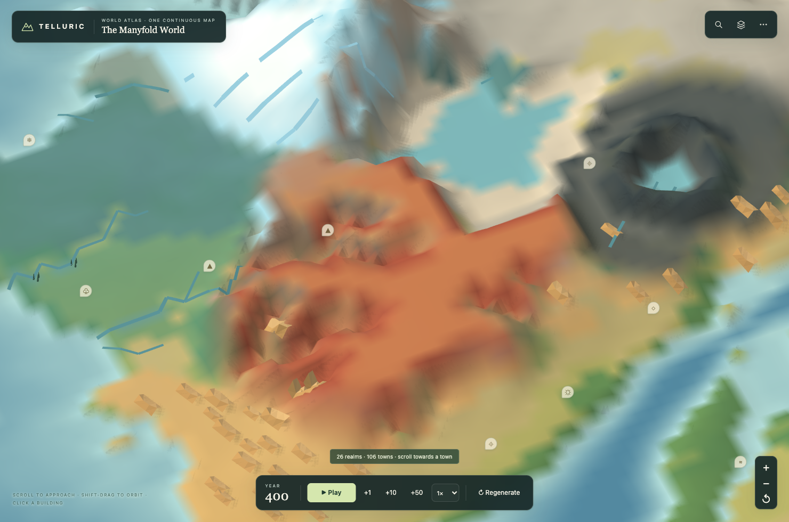
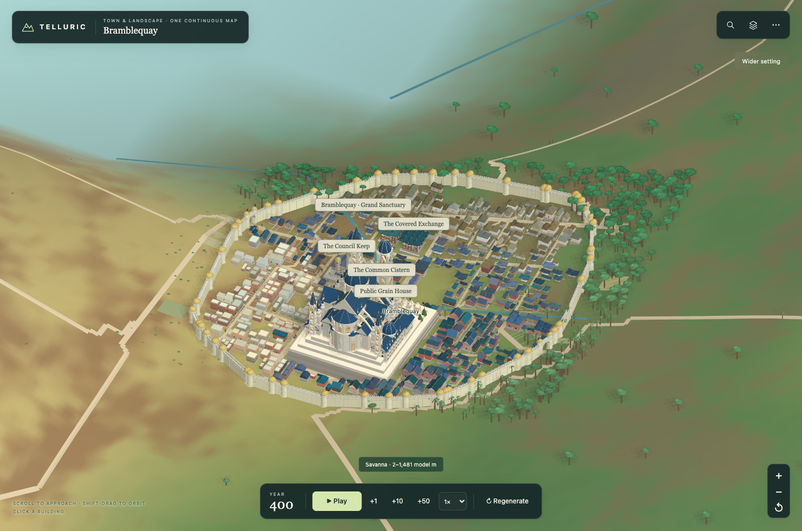
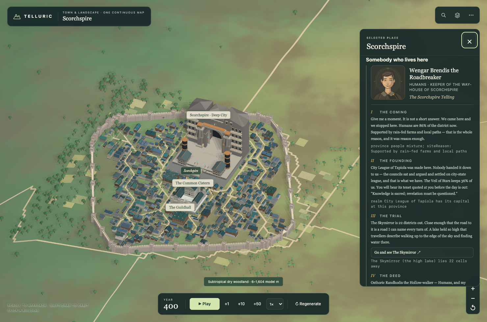

<picture>
  <source media="(prefers-color-scheme: dark)" srcset="assets/brand/telluric-wordmark-dark.svg">
  
</picture>

一张自动生成的奇幻世界地图，可以从大陆一路放大到城市街道。在浏览器里探索国家与居民，看历史继续发展。

**[在线体验](https://haofeiyu.me/telluric/)** · [English](README.md)



*默认世界 Aereth-47。点击国名可查看疆域、人口与历史；国内湖泊纳入周边国家，开放荒野保留明确标示。*

## 开始探索

| 想做什么 | 怎样操作 |
| --- | --- |
| 从世界放大到城镇 | 滚轮、双指捏合，或 **+ / −** 按钮 |
| 移动或旋转视角 | 拖动平移；**Shift + 拖动**或右键拖动旋转 |
| 找到一个地方 | 打开 **Search**，或按 **/**；选择 **Zoom ↗** 接近城镇 |
| 查看国家或建筑 | 点击名称、标记或建筑；悬停国名可高亮国界 |
| 返回世界全景 | 点击左上角 **TELLURIC** 标记或按 **H**；**Wider setting** 可从城镇拉远 |

底部 **Play** 和年份按钮用于推进历史。**Regenerate** 可按种子与设置生成新世界。**⋯** 菜单提供保存、读取、编年史和导出；生成新世界前，先保存想保留的世界。

## 地貌各有性格



*红土台地与峡谷崖壁。此图关闭了树木、城镇和国界图层，便于观察地形本身。*

世界中会出现红层台地、玄武岩火山口、高峰错落、山脊分叉的群山和石灰岩峰林。它们的起伏会改变河流、气候与聚落选址。平缓高地保留土壤和植被，陡壁露出对应岩色，寒冷地区才覆盖雪冰。

可以搜索地貌名称来定位。重新生成世界即可体验新地形；旧存档保留原来的地理和历史。[查看地貌说明](docs/FANTASY_LANDFORMS.md)与[山系、气候对照](docs/MOUNTAINS_AND_CLIMATE.md)。

## 城市生长在原有地形上



*Whitebeck：住宅与街道围绕城市地标展开，城墙外连接着农田与水岸。*

逐步放大，就能看到同一片土地上的房屋、城墙、神殿、王宫与港口。近处地形会变得更细致，气候也会影响地表、植被和建筑外观。点击建筑可查看说明，**Details** 面板还可导出 GLB 格式的城镇三维模型，模型不含周围地形。

城市细节按需加载；设备较慢时，首次生成和大型城市需要多等一会儿。地形与建筑采用风格化比例。

## 居民、国家与故事



*居民 Wengar Brendis 讲述 Scorchspire 的故事。每个章节都会附上所依据的世界数据或历史记录。*

世界中生活着七个族群。新建国家以一个族群为主，同时保留少数族群；迁徙与政治事件可以改变人口构成。国名来自多个神话传统，国家概览会解释名称出处。

选中城镇后，点击 **Hear the whole story**，即可认识讲述者，阅读建城故事、历史冲突与当地地标。地图中的传说地点也有对应的地理依据，例如河流源头、山峰或火山。

## 本地运行

下载或克隆仓库后，用现代浏览器打开 **[dist/telluric-onemap.html](dist/telluric-onemap.html)** 即可离线游玩，无需账号、API 密钥或额外下载资源。

开发需要 **Node.js 20+**，无需安装 npm 依赖：

```bash
npm run dev
```

打开 **http://127.0.0.1:5173**。修改源码后，重新生成离线 HTML 与 Worker，再运行测试：

```bash
npm run build
npm test
```

重新生成地图会应用新的生成规则；读取旧存档会保留原有历史。

## 深入了解

- [国家与人口](docs/POLITIES.md) · [国界与荒野](docs/LAKE_TERRITORY_AND_LABELS.md) · [神话国名](docs/REALM_NAMES.md)
- [城市与地形](docs/CITY_COHERENCE.md) · [气候与景观](docs/BIOME_LANDSCAPES.md)
- [居民故事](docs/CITY_SAGAS.md) · [建筑图集与 GLB 导出](docs/WONDER_REFINEMENT.md)
- [加载性能](docs/MAP_LOADING.md) · [地图架构](docs/CONTINUOUS_ARCHITECTURE.md)
