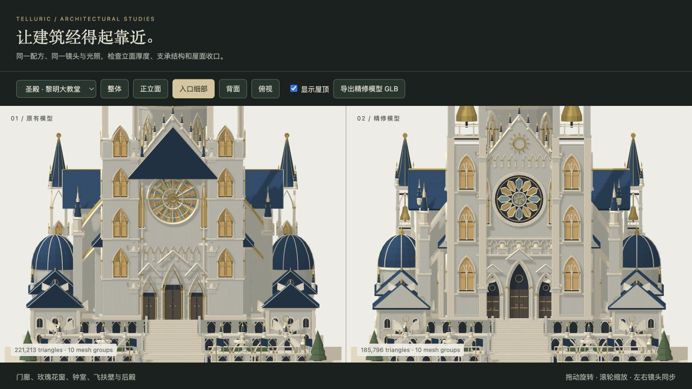
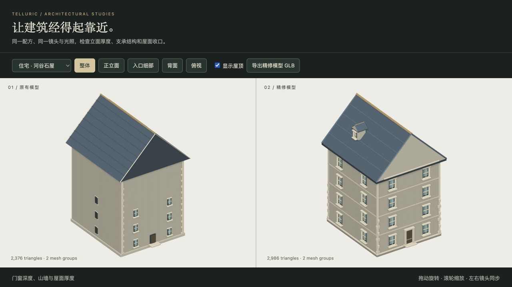

# Architecture refinement

This revision makes the existing procedural buildings hold up at street distance. It keeps the authored silhouettes, recipes, settlement placement and climate vocabulary. The same generators supply the continuous town renderer, the inspection preview and the exported GLBs.

## Visible changes

- Grand sanctuaries have load-bearing belfry corners, hanging bells, layered open entrance arches, splayed window reveals, a deep stone rose with separate glass petals, substantial flying buttresses and a roof over the rear apse. The nave roof stops behind the front stone gable instead of covering it.
- Houses have windows distributed across their actual storeys, correctly facing side openings, framed doors, continuous terrace coping and dormers that emerge through the appropriate roof slope. Openings follow the thicker lower adobe wall.
- Shared halls, palaces and guild buildings gain projecting sills, cornices, closed roof edges and ridge details. Roof and beam face orientation is corrected. Roof attachments remain in the removable roof group.
- Detail uses the existing LOD contract. Repetitive masonry grooves and duplicate roof layers are reduced while entrances, structural supports and visible windows survive at the town's LOD 1.

## Inspect the comparison

Run `npm run preview:architecture -- --baseline b5f00bc`, then `npm run dev` and open `/previews/architecture/`. The committed HTML is standalone and also opens from disk. `b5f00bc` is the parent revision, after the portrait PR.

The original and refined models share a camera and the current renderer, so differences come from geometry rather than lighting. Ten selectors cover sanctuaries, palaces, civic precincts and houses. Inspect the front, entrance, rear and overhead views; drag to orbit, toggle roofs, or export the refined geometry as a GLB. The preview never modifies a saved world.

## Validation

The new construction tests check outward normals, closed roof volumes, passable arches, recessed glazing, unobstructed side and dormer windows, adobe wall depth, roof attachment grouping, seeded replay and bounded mesh costs. These supplement the existing landmark, sanctuary, parcel-fit and climate tests.

Final verification on Node 23.6.0:

- The full `npm test` run completed with **132 passing tests and one existing failure**. `tests/artisan.test.mjs` expects the first citadel town to have a constructed gate. That town, Foamchase, has zero gates in the parent revision too. The same test was rerun from a clean `git archive b5f00bc` checkout with `node --test --test-name-pattern='Hilltop reserve' tests/artisan.test.mjs` and reproduced the identical assertion. The wall layout and assertion are unchanged here.
- After the final visibility fixes, `node --test tests/architecture-primitives.test.mjs tests/artisan-detail.test.mjs tests/sacred-detail.test.mjs` passed **15/15** tests.
- `npm run build`, `npm run assets`, `npm run assets:artisan` and `npm run assets:sanctuary` completed. All **38** generated GLBs have valid GLB 2 lengths, named meshes and POSITION/NORMAL/COLOR_0 attributes, with no images or textures. Regeneration also fills previously missing sample exports for the six already-supported newer building families.
- Browser inspection covered all ten preview selectors, sanctuary front/rear views, palace and domestic facades, roof removal, and the actual Whitebeck sanctuary in the continuous town map. The screenshots and DOM-observed model counts are in [`previews/architecture`](../previews/architecture/). This is visual integration validation, not a frame-rate benchmark.

Representative triangle counts from the synchronized comparison (same recipe and LOD on each side):

| Model | Original | Refined |
| --- | ---: | ---: |
| Grand sanctuary, town LOD 1 | 221,213 | 185,796 |
| Gilded palace, town LOD 1 | 56,744 | 53,672 |
| Mountain civic precinct, LOD 1 | 33,586 | 18,430 |
| River civic precinct, LOD 1 | 50,070 | 31,878 |
| Tall river house, LOD 2 | 2,376 | 2,986 |

The sanctuary example uses about 16% fewer triangles. Houses spend more geometry on exposed windows and joinery; the high-frequency housing tests enforce separate LOD budgets rather than assuming every building becomes cheaper.

The source builders remain the runtime assets. The GLBs in `assets/landmarks`, `assets/artisan` and `assets/sanctuaries` are regenerated examples of those same builders, not an image-based substitution or a new import pipeline.
