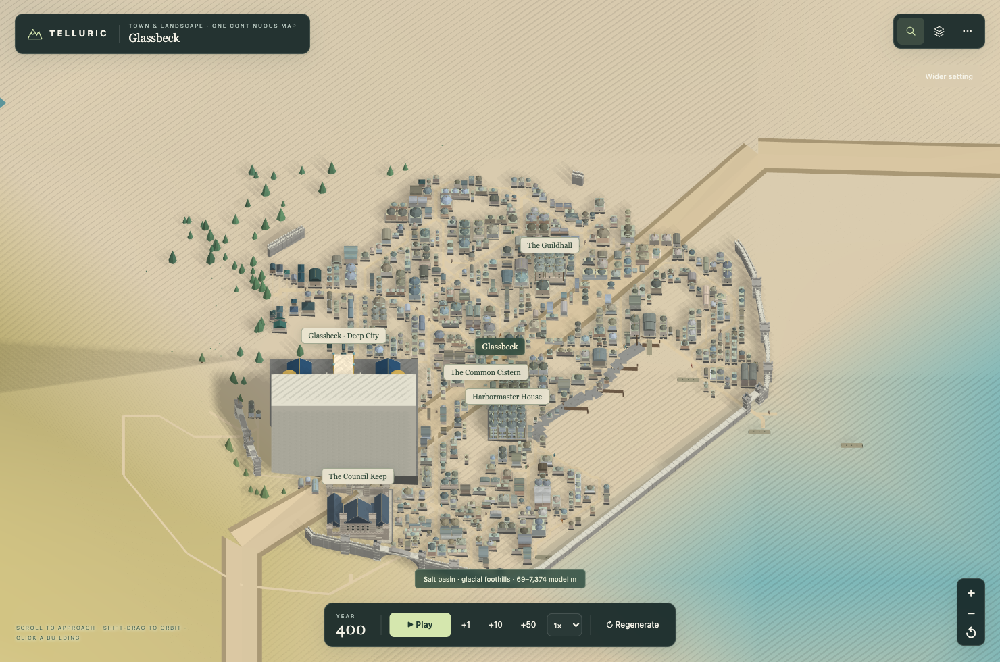
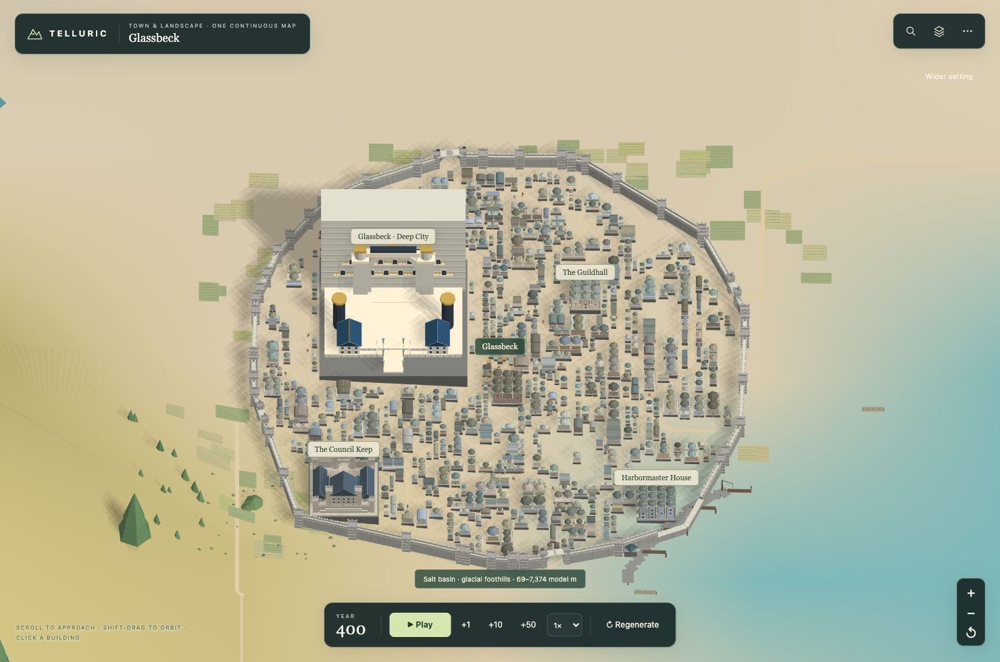

# City geometry and navigation fixes

Clicking into a town used to expose separate problems in the layout and its atlas placement: parts of a building could be assigned to a neighbour's elevation, steep wall sections were omitted, overlapping street ribbons flickered, and world roads crossed buildings at the width of map symbols.

The town now surveys the same compact footprint on which it is displayed. Routing uses the atlas's refined four-corner surface, and parcel relief limits keep foundations bounded while houses remain above the terrain. Mesh batches retain each building's identity, including foundations, overhangs, miniature landmarks and scaffolding. [Terrain refinement](TERRAIN_REFINEMENT.md) shows the actual mesh density beneath enlarged cities.

Walls, waterfront sections and gates form a single connected circuit. Gates correspond to real road crossings; wall and gate geometry follows shared ground heights. Streets are built as a nonoverlapping surface with joined corners. Near atlas roads use street dimensions and connect to exterior city approaches, with river crossings allowed only for existing bridge routes.

Markets now select traversable terrain, including the formerly empty Sandglen and Cairnshore layouts. Small towns retain a compact core, while larger populations receive more blocks. Additional fixes cover narrow parcels, access paths through buildings, vegetation placement, floating farm corners, diagonal shadow stripes, reopening search after entering a town, the road visibility toggle, and fitting the camera to the selected building.

The physical world and simulation remain unchanged. A province can have a harbour outside its compact urban footprint; a detailed waterfront is created only when that footprint actually reaches water.

## Visual comparison

Glassbeck, the default seed, at the same camera position:

Before:

After:

## Verification

- `npm test` covers deterministic layout, terrain parity, rigid building transforms, connected walls, street mesh intersections, safe access, population scale, existing world fingerprints, export and simulation.
- `npm run test:city-browser` opens the self-contained HTML, enters three towns through search, picks a rendered building, checks camera fitting, orbits, checks a mobile viewport, regenerates another world, and verifies the worker and offline operation. It requires Playwright; `PLAYWRIGHT_MODULE` and `CHROMIUM_PATH` can reuse an existing installation.
- `npm run build` regenerates the trusted worker and `dist/telluric-onemap.html` together.

The default seed's 102 eligible towns pass the existing population-scale checks: the smallest has 60 buildings, and population versus building count has a correlation of 0.412. The 12 largest towns retain all 59 incoming parent-road connections, including curtains that extend beyond the survey edge. Browser results are recorded in `previews/city-coherence/results.json`.
