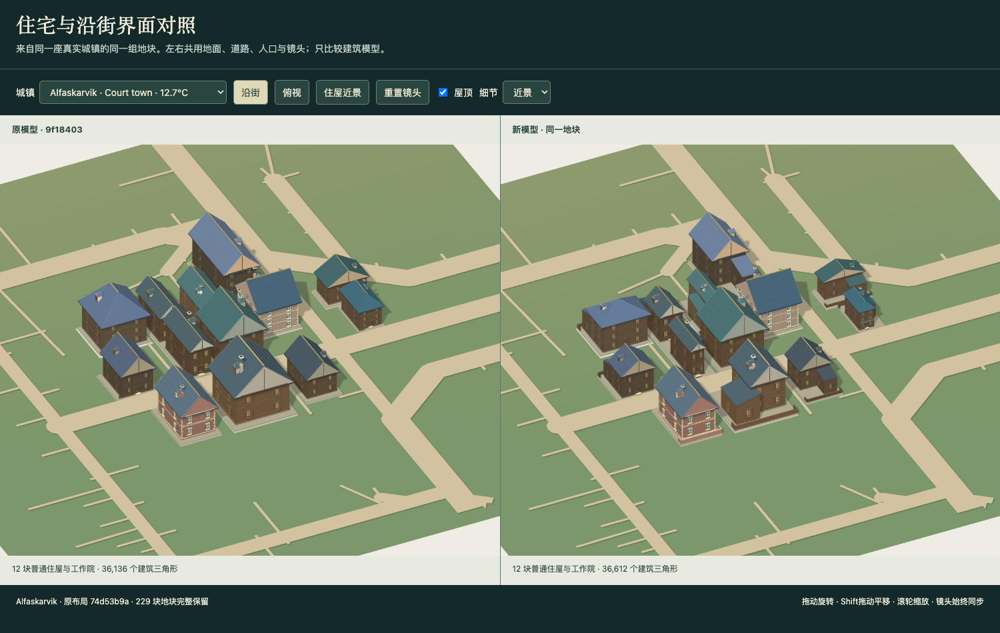

# Houses and street fronts

Ordinary houses combine a primary home with a lower corner wing, staggered range or rear extension. These are rooms belonging to the same household: the city generator still owns the parcel, household count, dimensions, street connections and population. Existing canopy settlements and monumental buildings retain their own construction paths.

The principal door faces the surveyed street. Shops attach an open counter and a shallow canopy to that facade; residential steps meet the actual door, including homes whose primary range is offset. Low rear boundaries replace the former tall side walls. The street edge and its surveyed approach remain open. Climate still chooses wall materials, main roof forms, eaves and snow, and attached roofs belong to the removable roof assembly.

Compact infill plots remain one house each. Their street fittings add no geometry at distant LOD and only shallow steps or a small counter closer up. Attached ranges simplify concealed windows and small construction details. Fittings are bounded by the existing parcel and do not take space from neighboring lanes.

## Inspect the result

Run `npm run preview:streets`, then `npm run dev` and open `/previews/streets/index.html`. Both views use the same surveyed town, selected parcels, ground, streets and camera. The left uses the recorded baseline's builders; the right uses the current builders. Switch between street, overhead and close views, toggle roofs, or change the level of detail. `layout-proof.json` records the selected lots and complete layout signatures.

The three captured neighborhoods contain 32 original parcels. Close-detail triangle counts change from 41,554 to 43,290 in the fjord sample, 36,136 to 36,612 in the river sample, and 23,370 to 23,350 in the sanctuary-town sample. These are model counts for these samples, not whole-world loading benchmarks.

## Verification

`node --test tests/domestic-forms.test.mjs tests/street-frontage.test.mjs tests/domestic-compounds.test.mjs tests/artisan-detail.test.mjs` checks joined silhouettes, exposed doors and windows, roof removal and snow, deterministic replay, all climate roof families, approach clearance and the mesh budget. Compound checks exercise all 15 traditions in four orientations, including 1.1 × 1.1 infill lots, while preserving counts and saved input state.

[Recorded browser and geometry results](DOMESTIC_STREETS_RESULTS.json) include the actual worker/source Float32 comparison, a v6 save restored through the file chooser, and compatibility with the separate density branch. The 15 civic precinct models also remain byte-identical to main #69.

The module is included in the ordered source manifest, the generated town worker and both offline download names. Build the worker and offline files with `npm run build` after editing either model builder.
