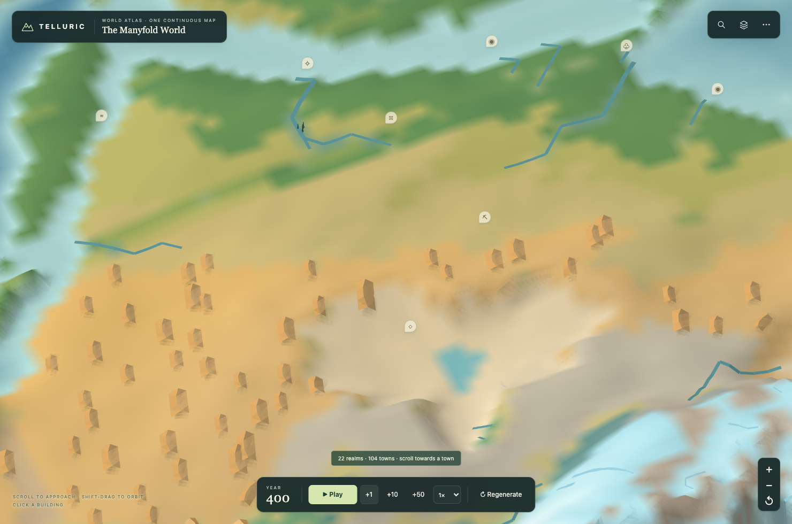
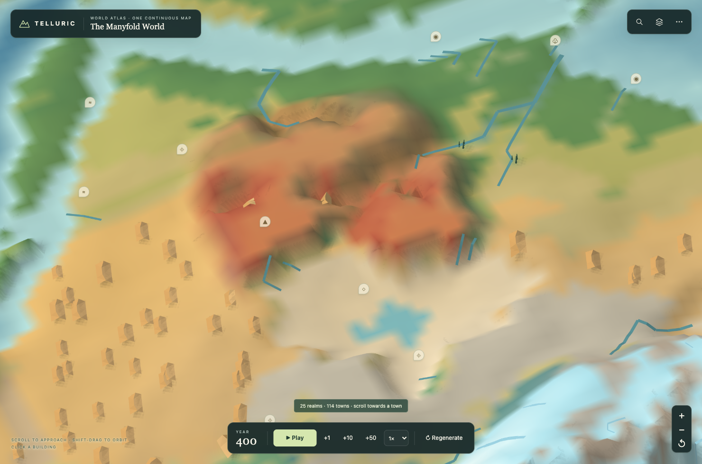
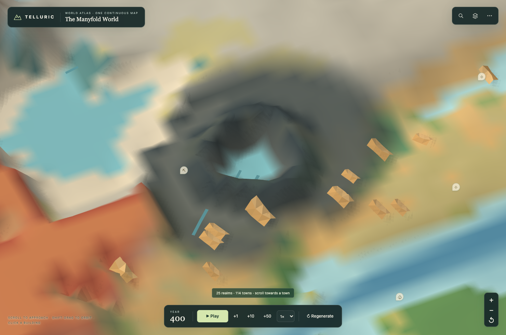
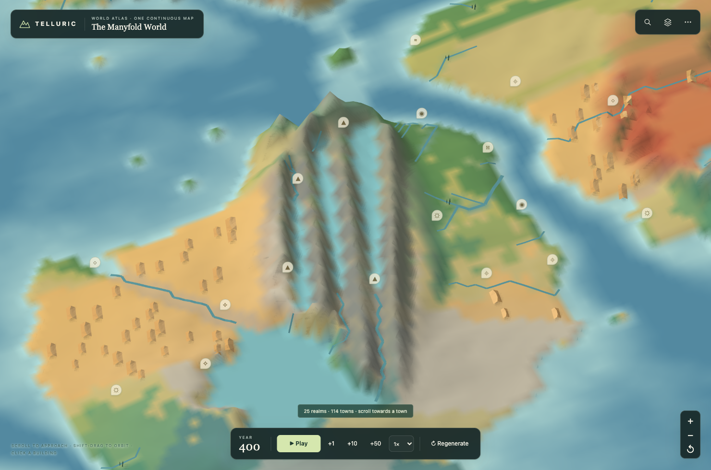
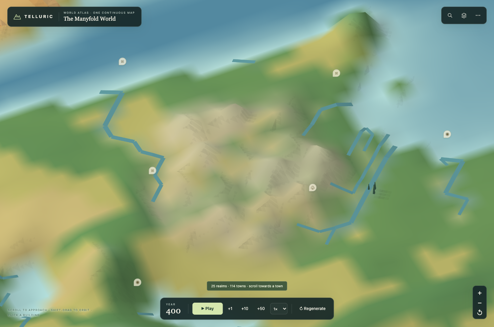

# 奇幻地貌

新版世界有四类成片的地貌：赭红台地与峡谷、玄武岩火山原、平行褶皱山岭和石灰岩峰林。它们改变实际地面高度，河流、湖泊、气候、道路和聚落随后使用这片新地形。

点击 **Regenerate** 生成新版世界。搜索以下地名即可定位；点击区域内的土地可查看地貌说明。旧存档保留原来的地理与历史。

| 地貌 | 默认种子中的搜索示例 | 形状与颜色 |
| --- | --- | --- |
| 红层台地 | The Painted Stair | 赭红砂岩、宽阔台地、分支峡谷和陡峭崖壁 |
| 火山原 | The Obsidian Wastes | 冷黑玄武岩、熔岩起伏、塌陷盆底与环形火山口壁 |
| 褶皱山系 | The Thousandfold Ranges | 成组的平行山脊、纵向深谷与低矮山口 |
| 石灰岩峰林 | The Jade Needles | 浅色岩峰成簇分布，低处连接着植被与河谷 |

## 台地与峡谷

下图采用相同镜头、相同种子，对比原有地形与新版地形。为了看清坡面，关闭了树木、聚落和国界图层；地面与水系仍由应用正常渲染。

| 原有地形 | 新版地形 |
| --- | --- |
|  |  |

峡谷沿原有集水路径延伸，主谷和支谷切入抬升后的台地。高原表面仍有宽阔的缓坡，边缘与谷壁形成明显落差。

## 火山、山系与峰林

*玄武岩火山原。火山口是真实的环壁和凹陷，积水由后续水文计算决定。*

*褶皱山系。数条弯曲山脊共同延伸，山谷贯穿其间。*

*石灰岩峰林。岩峰集中在一小片温暖地区，与宽广台地和长山系形成尺度区别。以上三图也关闭了树木、聚落和国界图层。*

## 高原的颜色

高海拔本身不再意味着灰色裸岩。平缓高地保留草地、苔原和土色；陡峭坡面才露出相应岩石。红砂岩、玄武岩与石灰岩的材质在远景、近景和坡面碎石上保持一致，水面、积雪与冰川仍由气候决定。

## 生成与兼容

地貌选址参考陆地宽度、纬度、板块碰撞、裂谷与岛弧。狭窄岛屿或特殊参数下，地貌数量会减少；不会为了塞入某一类型而填海或覆盖已有盆地。火山口保留完整核心，山系避开会截断主要山脊的盆地。

新世界的 `parameters.landformVersion` 为 `1`。旧存档缺少这个字段时，按 `0` 恢复；两种版本均保留在同一生成器中。生成地貌后重新求解水系和气候，再生成居民、城市和国家。近景细化与城市 Worker 读取相同的地形和岩性数据。

## 验证

- `fantasy-landforms.test.mjs`：逐字节检查三个旧种子的全部地理栅格；检查新版海岸保护、地貌连通、台地剖面、多列山脊、火山口环壁与确定性。
- `landform-colors.test.mjs`：检查高原缓坡、陡壁岩色、材质交界、缓存更新与雪冰优先级。
- `fantasy-landforms-integration.test.mjs`：在不同世界形态下检查国家主族群、领土连通、居民归属、道路水系、城市地基与存档续算。
- `fantasy-landforms.browser.mjs`：运行离线 HTML，检查真实地面拾取、桌面和手机国名、城市 Worker、所有地貌截图以及新旧存档恢复。

完整截图与浏览器记录在 [previews/fantasy-landforms](../previews/fantasy-landforms/)。可运行 `npm run test:landforms-browser` 复现；它使用本地 Chromium，支持通过 `PLAYWRIGHT_MODULE` 与 `CHROMIUM_PATH` 指定已有安装。
