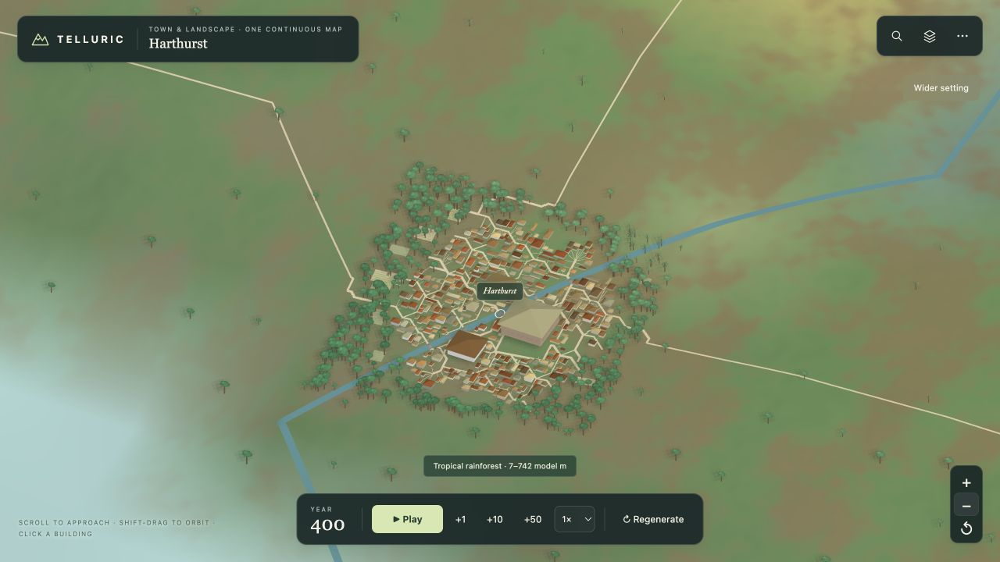

# Nearby landscape materials and gentle relief

Approaching a town used to reveal a smooth, uniformly green surface. The refined mesh interpolated the parent heights and colours, but it had no smaller soil patches or terrain variation between those samples.

Close terrain now mixes grass, exposed earth, damp ground and mineral colours through continuous, seeded fields. Temperature, moisture, snow cover and slope control the mixture. Sandy ground retains its existing hue, while water and full snow cover retain their original colours. The far world map still uses its existing palette.

Small rises and hollows sit between the original height samples. Their amplitude decreases on steep slopes, and their analytic gradients also tilt the lighting normals. The residual is exactly zero at every original lattice vertex and continuous across cell edges. Its mathematical bound at relief 1 is 0.022 atlas units; the default-world regression measures a maximum absolute displacement of about 0.0123 and an added grade below 0.089.

`CityEnvironment.atlasSurface`, parcel bounds, layout grades and physical world arrays remain unchanged. `AtlasSpace.surface` adds display relief outside protected areas and shares that height with vegetation, roads, rivers and picking. Every eligible town's full survey receives a protected margin, including 10% spare extent for capital changes while a cached model is replaced. Protection depends on all settlements, not on which city meshes have streamed. Coast, lake, ice and both raw/corrected river corridors also retain their original heights, with a smooth fade into surrounding relief.

The lightweight `citySurvey` helper extracts the generator's existing footprint arithmetic without changing random-number consumption. Survey dimensions participate in model cache keys. Terrain, vegetation, roads and river caches refresh when the landscape protection changes; workers prepare the same field before collecting town geometry.

When a town retires or its survey changes, its old model is removed before its previous ground protection is released. A pending worker also rejects geometry for an obsolete survey. This covers capital changes and newly eligible neighbouring settlements that reduce the space available to an existing city.

## Native map comparison

[Open the interactive comparison](../previews/landscape/index.html).

The before images come from `main` commit `2f9de96`, including the merged city layout and tree fixes. Both versions use the default world at year 400, enter Harthurst with **Zoom to town**, then click **Zoom out** twice for the surrounding landscape. All captures show the actual running map at 1280 × 720.

## Regression coverage

- `landscape-color`: smooth colour fields, water/snow protection, climate-specific palettes and unchanged inputs.
- `landscape-relief`: stable preparation, town/capital/water protection, lattice identity, continuity, gradients, bounded relief and unchanged full city layouts.
- `landscape-integration`: actual terrain normals and colours; road, river, selection and tree contact; loading stability; worker/main mesh equality; unchanged world and society data.
- Existing terrain stitching, zoom lifecycle, vegetation scale, roads, rivers, underground openings and OneMap checks are included in the final validation.

Final validation: **137 distinct targeted tests passed**, including the additional settlement/worker lifecycle regressions. The build and whitespace checks passed. Harthurst was also checked through the native map, and both view/version controls on the comparison page were exercised.
