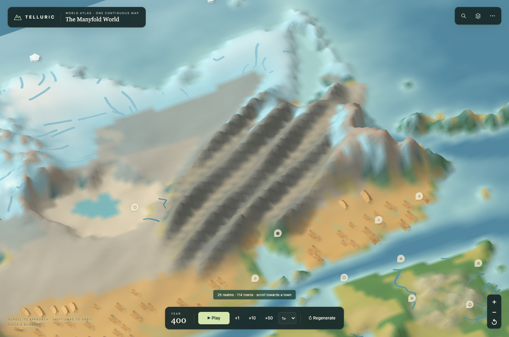
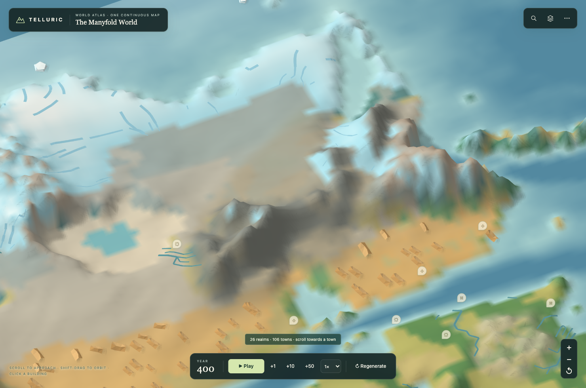

# 山系与气候

新版山系由大小不同的山块、错落高峰和分叉山脊组成。宽谷、狭谷和低山口穿插其中，整体走向参考板块碰撞。原先固定间距、等宽的平行山脊保留在旧版存档中。

| 旧版山系 | 新版山系 |
| --- | --- |
|  |  |

*同一种子、同一地点、完全相同的镜头。关闭树木、聚落和国界等图层，便于观察实际地面。两组山系及镜头数据见 [浏览器记录](../previews/mountain-climate/results.json)。*

## 山脉会影响气候吗？

会。生成器先改变地面高度，再计算洋流、海温、水汽输送、降水和冰雪：

- 高度进入气温计算，基础递减率为每千米约 5.8°C。
- 盛行风吹向上升坡面时，凝结增强；降水消耗水汽，影响背风侧。
- 洋流输送海洋热量，海温影响沿岸温度、蒸发和凝结，影响随距海距离减弱。
- 最后的温度与水分共同决定植被、雪冰、水系和聚落条件。

这些联系与[地形抬升降水](https://forecast.weather.gov/glossary.php?word=orographic)、[雨影](https://forecast.weather.gov/glossary.php?word=rain+shadow)和[洋流对气候的影响](https://oceanexplorer.noaa.gov/ocean-fact/climate/)有相同的定性方向。

## 怎样验证

测试在同一片土地上抬升山体，保持海岸线、纬度和其他参数不变；也把实际生成的两组山系削低后重新计算，比较同一批格子。它检查真实的温度、降水和水汽，不把“雨影”标签当作证据。

下面是受控试验的一组结果：

| 同一批格子 | 抬升前 | 增加约 4 千米山脊后 |
| --- | ---: | ---: |
| 山脊气温 | 4.52°C | −18.37°C |
| 迎风侧降水指数 | 0.486 | 1.433 |
| 背风侧降水指数 | 0.296 | 0.061 |
| 背风侧水汽指数 | 0.491 | 0.109 |

在完全相同的地形上关闭洋流，海温平均绝对变化约 0.35°C，沿岸气温变化约 0.48°C，内陆约 0.014°C。数值来自本程序的试验，不是现实观测；降水、水汽为相对指数，不能解读为毫米。完整参数、采样和源码指纹见 [气候对照记录](../previews/mountain-climate/climate.json)。

形态测试同时检查最终高度图的周期性、坡向和高地连通性。原先的梳齿山、以及仅打乱峰高和相位的等距山脊，都必须被检测出来。

## 模型的边界

这是未经实测校准的定性模型。风主要由纬度和季节给定，没有显式求解绕山风、气压系统或完整季风；海流采用二维近似，没有深海层和动态盐度。山脉也由程序化地形规则构成，没有模拟完整的地质年代演化。因此它能表达山地、洋流与气候的联系，不能用于真实地理预测。

新世界使用 `landformVersion: 2`。已经公开的版本 1 与最初版本 0 均保留原算法，旧存档按自身版本恢复。重新生成世界即可使用新版山系。

```sh
node --test tests/irregular-mountains.test.mjs tests/mountain-climate-causality.test.mjs
npm run test:mountains-browser
```

浏览器检查使用本地 Chromium，可通过 `PLAYWRIGHT_MODULE` 和 `CHROMIUM_PATH` 指定已有安装。
