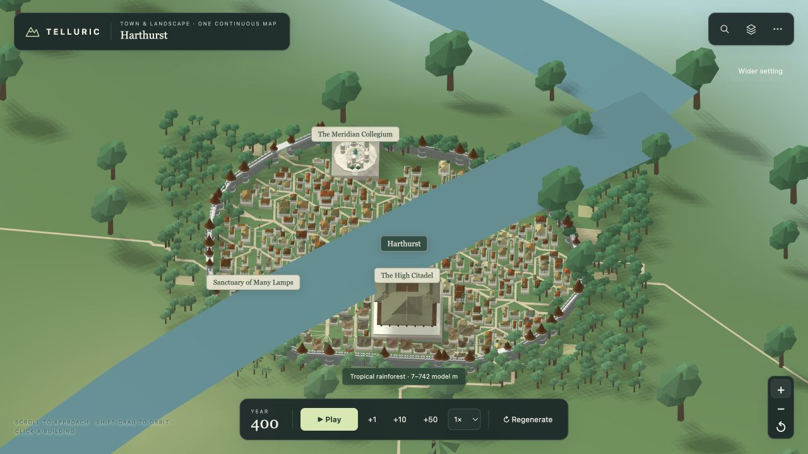

# River detail through cities

The atlas river overlay used four slices per drainage link (eight triangles), even after the surrounding terrain refined. It sampled height only along the centerline and lifted the entire ribbon by 0.095 atlas units. The same city channels also received a separate fixed 18-slice ribbon. At town scale, exaggerated map widths and heights covered buildings with coarse floating faces.

`RiverDetail` now owns both native channels and surveyed town tributaries in the close atlas view. A source cell is emitted once; the corrected world drainage remains authoritative for native links. Small surveyed tributaries below the atlas threshold survive. Loaded and unloaded native links use the same near width, derived from the dimensions and width formula already used to reserve city river corridors. The shared constants preserve the original city-generation arithmetic.

`RiverMesh.ribbon` samples the curved parent surface at every vertex along and across each channel. Shared endpoint cross-sections and common cross-channel subdivision prevent cracks at bends and confluences; derivative normals do not depend on a segment's longitudinal subdivision. Water sits at a subpixel offset above the surface, capped at 0.004 atlas units. No drainage, terrain heights, parcels or simulation state are changed.

The visible neighbourhood uses a 12 CSS-pixel subdivision target, power-of-two levels, and a 180,000-triangle detail budget. Distant drainage outside the padded camera window remains cheap. Settled zoom, pan and viewport changes rebuild only the river overlay after 160 ms; loading or evicting a town refreshes tributaries immediately. World replacement cancels pending updates. Returning to the world map retains the original river representation and the Rivers layer toggle remains available.

Town GLB exports include the local unified river mesh with a fixed 240-zoom, 1440 × 900 detail budget. Export geometry and height offsets are independent of the live zoom/window and do not change the live camera or selection.

## Actual map comparison

Baseline: `main` at `bc2f0ca` (after the underground-building correction). Screenshots use the actual map UI: select Harthurst, enter the town, then press Zoom in. Both versions retain the same city, camera and visible buildings.

[Open the before/after comparison](../previews/rivers/index.html)

Additional native screenshots cover further zoom into Harthurst and the Gullgrove confluence. Automated source checks survey only these two cities, including Gullgrove's smaller source-cell 23965 tributary.

For both cities, zoom 60 → 240 → zoom 240 at twice the viewport dimensions increases transverse subdivisions from 2 → 8 → 16, and longitudinal subdivisions from 32 → 128 → 256 for shared inspected links. The two-city, four-zoom, two-viewport budget matrix peaks at 163,840 detailed triangles out of 180,000.

## Verification

- `tests/river-mesh.test.mjs`: two-dimensional sampling, normals, winding, shared seams with unequal longitudinal subdivisions, deterministic output and degenerate input.
- `tests/river-detail.test.mjs`: actual parent-channel deduplication, retained tributaries, surveyed width before/after city loading, zoom/viewport detail growth, budget, uploaded surface clearance, local exports stable across nine camera/window combinations per city, and unchanged world/simulation fingerprints.
- `tests/terrain-refinement.test.mjs`: deferred zoom/pan/resize updates, gesture coalescing, unchanged-camera reuse, world-reset cancellation and the river toggle.
- Existing continuous-map, terrain/street mesh, environment, selection-marker and underground-building regressions are included in the final targeted run. The full simulation suite is not required for this rendering change.
- Independent review also sampled actual visible river vertices against rendered terrain in Harthurst and Gullgrove at zoom 60/620 and low camera elevation; no submerged visible vertices were found. Five-town camera checks found no coarse far ribbons in the viewport. Stormbeck/Pineshore underground openings remain separate from river channels.

Final targeted run: **92 tests passed**, with no failures. `node scripts/build.mjs` and `git diff --check` also passed.
