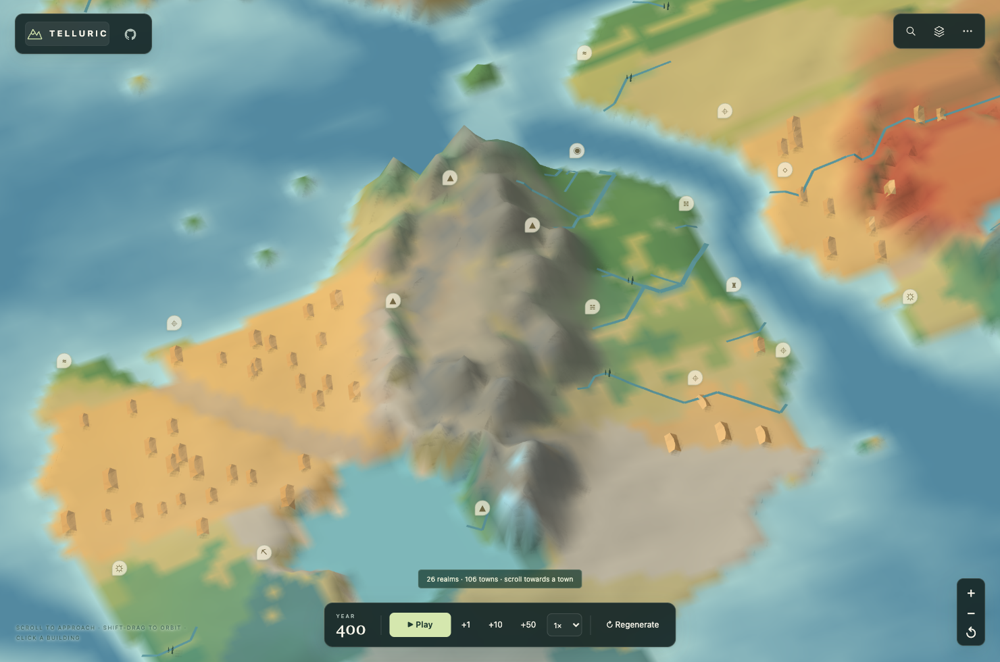
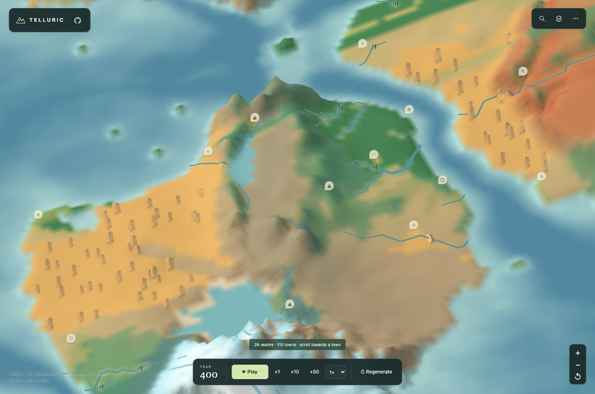

# 板块、洋流与地表覆盖

新版把造山、海洋输送、降水和地表覆盖一起修正。山地不再因为显示比例夸张而自动变成裸岩：湿润坡地保留森林和草甸，干燥高地保留土色，陡峭露岩、玄武岩与雪冰仍各有颜色。

| 版本 2 | 新版 |
| --- | --- |
|  |  |

*同一种子、同一位置、相同镜头，关闭树木与国界等图层以看清地表。此组图片同时包含构造、气候与颜色改变；下文另有只改变颜色的对照。[镜头与存档恢复记录](../previews/tectonic-climate/results.json)。*

## 原先哪里脱节

- 板块形状使用扭曲的加权距离，边界运动却沿两块板块中心的连线计算。默认地图中，修正局部边界法向和两侧地壳取样后，约 14.4% 的边界样本改变压缩、张裂或走滑分类。
- 高原和区域山峰使用固定高度目标。把造山强度设为零，旧规则仍能产生约 3.7 千米的高原屋顶和 4.65 千米的区域山峰。
- 沿岸温度取最近海点，没有区分海水在迎风还是下风方向。山坡凝结又立即转为降雨，限制云水越过山脊。
- 裸岩判定使用夸张后的显示坡度，近景随后又覆盖一层矿物色。固定旧地形与气候，在 762 个湿润、少雪的高地格子中，274 个近景颜色呈低饱和灰色。

这些数字是本程序的诊断，不是现实世界的统计。

## 现在怎样生成

**构造决定主要抬升。** 以实际板块归属场的局部法向计算相对运动，检查边界两侧的真实陆洋地壳。俯冲火山弧和海沟限制在对应板块一侧。高原和不规则山块的新增高度受邻近挤压与造山强度控制，山带沿造成压缩的边界展开。

**海流与大气使用同一套季节风。** 海面环流由两季风应力的空间变化驱动，并受大陆边界限制。陆地的海洋影响沿上风方向取样，随跨越陆地的距离和山体阻隔衰减；近岸仍保留较弱的局地海洋调温作用。低于海水冻结阈值的冷量转为定性结冰潜能。

**水汽和云水都随风移动。** 抬升和过饱和产生云水，云水经过有限时间降落，也能在干燥下沉的空气中重新蒸发。迎风降水与背风雨影仍存在，但不会在一个格子里把凝结水全部扣为降雨。温度和最终水分共同决定植被、冰雪和径流。

**植被、土壤、露岩共同决定地色。** 森林和草甸的覆盖来自生物群区、温度与水分；邻格的物理高差只作为露岩程度的代理，不当作实测坡角。远景和近景共享同一覆盖比例，近景添加细纹理，避免重复用裸岩色盖住整片山坡。

## 颜色对照

固定已发布的版本 2 地形、气候和季节雪，只替换颜色规则：

| 同一批采样格 | 原规则 | 新规则 |
| --- | ---: | ---: |
| 湿润少雪高地的近景灰色 | 274 / 762 | 14 / 762 |
| 湿润少雪高地的近景绿色 | 263 / 762 | 560 / 762 |
| 干燥高地的近景绿色 | 0 / 3013 | 0 / 3013 |

这统计的是地表材质采样，包含季节雪预混，不是截图像素；灰色定义为 HSV 饱和度低于 0.15。永久雪冰的材质结果保持原样。参数、统计定义和源码指纹见[颜色对照记录](../previews/tectonic-climate/landcover.json)。

## 地理依据与模型边界

大陆碰撞和海洋俯冲产生不同的造山与火山环境，见 [USGS 板块构造说明](https://pubs.usgs.gov/pdf/planet.pdf)。海岸风能把表层海水推向外海，引起冷水上涌，见 [NOAA 上升流说明](https://oceanservice.noaa.gov/facts/upwelling.html)。高山超过林线仍可以有苔原和草甸，见 [NPS 高山生态说明](https://www.nps.gov/romo/learn/nature/alpine_tundra_ecosystem.htm)。

这是定性的奇幻地图生成器。它没有模拟完整地质年代、真实沉积史、三维气压场、绕山风、深海或盐度；海温、风和降水参数也没有按现实观测校准。红层台地和岩溶等区域地貌仍含明确的设计先验。降水与云水是相对指数，不能解读为毫米。

## 构造验证

局部边界测试改变板块速度而保留板块形状；抬升测试保留同一底板，分别改变挤压场和造山强度。默认地图高于 3500 模型米的陆格从 1073 降至 569；造山强度为零时，旧版仍有 389 格，新版为零。地貌塑形阶段保护自身输入的海陆边界；构造阶段本身可以改变新世界的海岸。

形态检测读取最终高度图，检查横断面频谱、坡向集中程度、宽峰的高度、位置和宽度变化；规则梳齿及仅扰乱相位的梳齿均作为负例。参数、节点与高度结果见[构造记录](../previews/tectonic-climate/tectonics.json)。

## 气候验证

在同一片土地上抬高山脊，保持纬度、海岸和其他参数不变，重新计算实际气候数组：

| 同一批格子 | 平地 | 抬升山脊 |
| --- | ---: | ---: |
| 山脊气温 | 4.91°C | −17.97°C |
| 迎风侧降水指数 | 0.509 | 1.486 |
| 背风侧水汽指数 | 0.509 | 0.143 |

另有两组反事实：交换两侧冷暖海温时，陆地响应随季节风向反转；把实际生成的两组山系削低时，山地降温、迎风增雨、背风水汽减少的关系均可复现。所有受控世界的水汽与云水预算相对误差小于 `6 × 10⁻⁷`。完整取样、版本、参数和结果见[气候记录](../previews/tectonic-climate/climate.json)。

云水随风、有限降落时间和下坡再蒸发的机制参考 [Smith 与 Barstad 的原始论文](https://journals.ametsoc.org/view/journals/atsc/61/12/1520-0469_2004_061_1377_altoop_2.0.co_2.xml)；程序没有实现该论文完整的山岳波理论。

## 存档

新世界使用 `landformVersion: 3`；重新生成地图即可启用。版本 0、1、2 保留已发布的地形和气候规则，旧存档按自己的版本恢复。兼容检查比较每个物理数组的原始字节，而不只比较缩略指纹。

## 复现检查

```sh
npm run build
node --test tests/tectonic-coupling.test.mjs tests/ocean-climate-v3.test.mjs tests/landcover-colors.test.mjs
node --test tests/fantasy-landforms.test.mjs tests/irregular-mountains.test.mjs tests/fantasy-landforms-integration.test.mjs
npm run test:tectonic-climate-browser
```

浏览器可用 `PLAYWRIGHT_MODULE` 和 `CHROMIUM_PATH` 指定已有 Playwright 与 Chromium 安装。实际界面检查覆盖四类地貌定位、桌面与手机国名、城市 Worker 数据一致性，以及新版和旧版存档恢复，见[浏览器报告](../previews/tectonic-climate/exploration/results.json)。


加载验收还发现并修复了一个与地下庭院有关的问题：更换世界时，批量卸载旧城会重建即将丢弃的地形。现在先解除旧世界绑定；同世界清理和单城移除仍会补回地面。[调用栈记录](../previews/tectonic-climate/regeneration.json)。最终离线功能运行约 11.98 秒就绪，首次与重生成均只构建一次地形，170 条地标目录、城市数据、无 Worker 回退和失败恢复全部通过；这是单次记录，见[加载报告](../previews/tectonic-climate/loading/results.json)。
