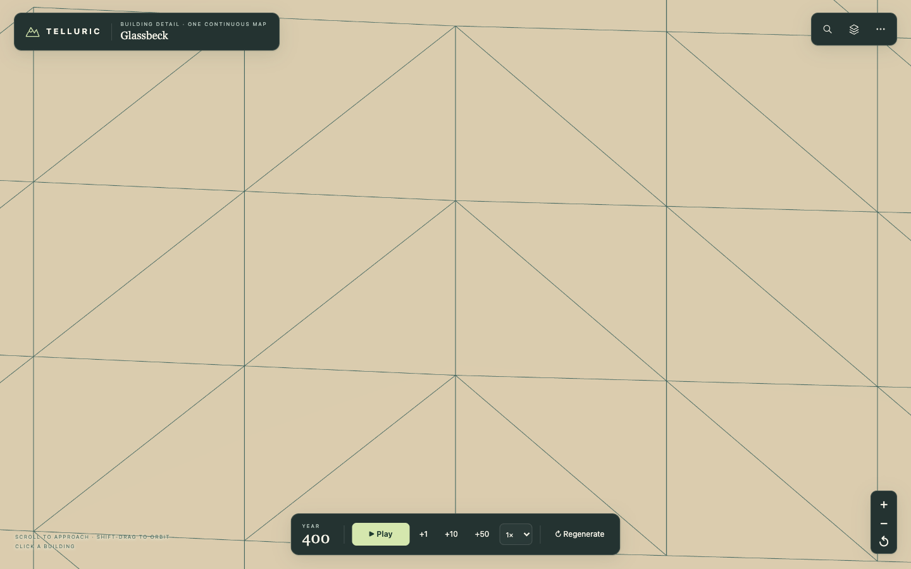
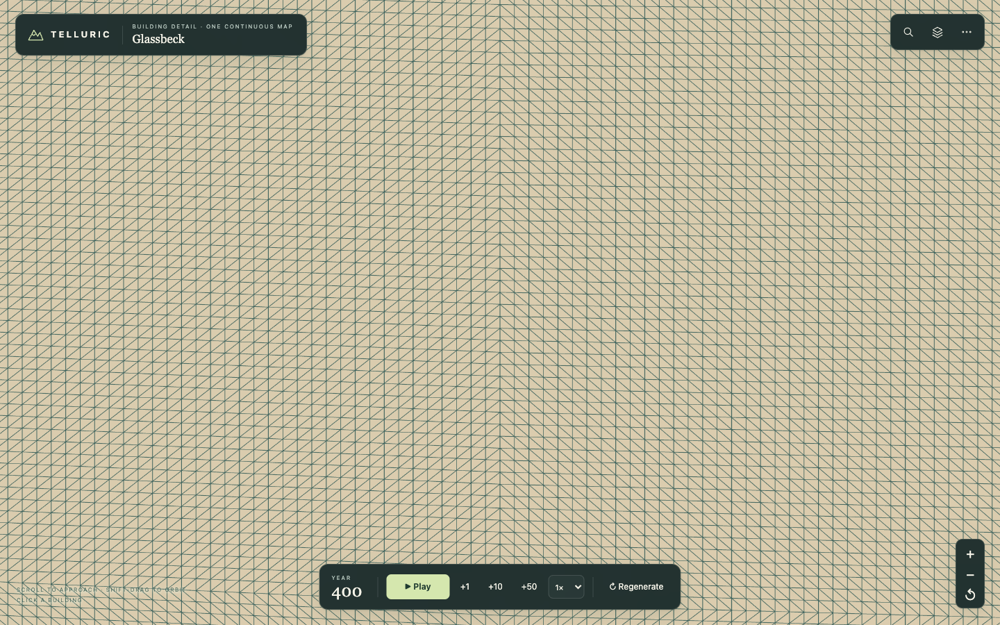

# Terrain detail beneath enlarged cities

The land beneath a city kept its coarse triangles as the camera moved closer. Close-view road updates accidentally bypassed the terrain rebuild, subdivision stopped at eight samples per parent-cell edge, and the inserted vertices still lay on the original two flat faces.

Near terrain now interpolates all four inherited corner heights. Layout grades, building foundations, picking and streets use that same curved patch, so finer ground does not move independently of the city. Ground colours also interpolate across all four corners instead of retaining a large diagonal colour boundary. The world map keeps its original coarse surface, and its road and river overlays are reseated when entering or leaving detail.

The visible region receives up to 128 subdivisions per parent-cell edge, selected from projected pixel size and limited by a mesh budget. Neighbouring levels share stitched boundary vertices, including colours and normals. Camera zoom, pan and viewport resizing request a settled terrain rebuild, and replacing the world cancels pending work.

## Actual uploaded mesh comparison

Glassbeck at zoom 620 in a 1440 × 900 viewport. Buildings are hidden only for these diagnostic screenshots; lines show the edges actually uploaded to the renderer.

Before:

After:

| Measurement | Before | After |
| --- | ---: | ---: |
| Subdivisions per parent-cell edge | 8 | 128 |
| Largest measured visible triangle edge | 438.9 px | 27.5 px |
| Triangles in the inspected viewport region | 24 | 5,266 |
| Complete terrain mesh | 120,844 triangles | 250,412 triangles |

The detailed mesh's sampled interior height error is below 0.000001 atlas units in this closeup. The underlying world-height samples, geography and population remain unchanged. Fine roads also subdivide where surface curvature could otherwise cover the interior of a road triangle.

## Verification

- `npm run test:terrain-browser` enters a city through search, checks the actual terrain buffers at zooms 86.4, 240 and 620, then pans and resizes. Returning to the world map restores its original road and river vertex buffers exactly. It saves the diagnostic images and measurements above. The optional Playwright setup is the same as `test:city-browser`.
- `tests/terrain-refinement.test.mjs` exercises actual deferred camera updates, including resize and world replacement.
- Terrain tests cover curved interpolation, exact parcel bounds, road clearance, mesh budgets, and continuity between refinement levels.
- All 102 default-world towns retain dry, non-overlapping, connected building parcels; population versus building-count correlation is 0.412, with 60 buildings in the smallest town.
