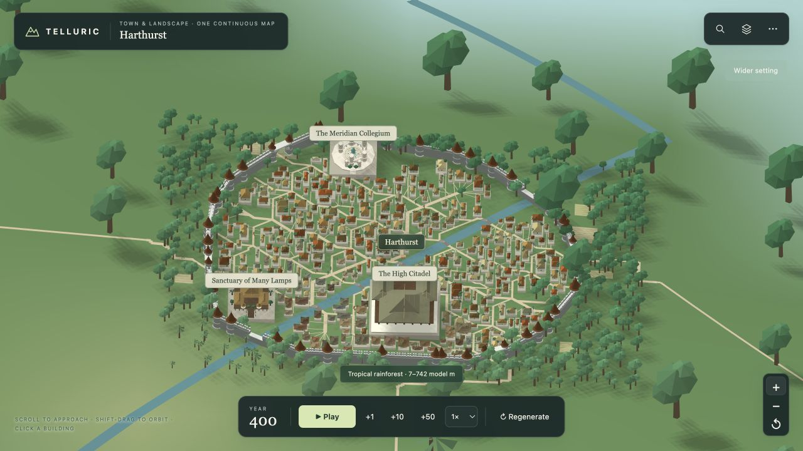
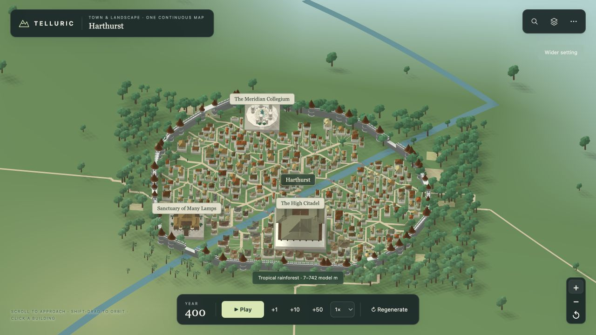

# Nearby vegetation at town scale

At town zoom the world-map tree symbols already turn off, but two replacement layers used large, unconverted atlas-unit heights: `cm:<id>:vegetation` used 0.09–0.145 and `cm:env:flora` used 0.075–0.125. City trees instead used their authored 2–4.1 local-unit height, climate stature and a frame scale of about 0.008538. Approaching a city therefore showed outside trees several times larger than its own trees.

For the parent `main` commit `1d46467`, Harthurst's ordinary planted trees had a median rendered height of 0.043 atlas units. Nearby rainforest specimens reached 0.116–0.187, with crowns spanning approximately four to six ordinary house widths. The discrepancy persisted through the full 16–620 town zoom range.

`CityEnvironment.treeHeight` now shares the existing city specimen formula with both nearby planting layers. `AtlasSpace.TOWN_UNIT` converts surrounding landscape vegetation using the same surveyed footprint as the city frame, without depending on camera zoom, population or streaming completion. The city generator retains its arithmetic and random-number consumption. Tree shapes, climate colours and planting locations stay deterministic.

Meadow tufts and wetland reeds also used atlas-size constants; they now have local heights of 0.91–1.56 and 1.2–1.6 town units respectively, below ordinary trees. Their width and spacing use the same conversion. The coarse alpine cushion silhouette now stays low like its full-detail version, and treeless/zero-height specimens emit no geometry.

## Visual check

[Open the same-camera comparison](../previews/trees/index.html)

The baseline screenshots are the actual Harthurst captures committed with PR #36, copied from `previews/rivers/harthurst-after-*`. After screenshots use the same city-entry action and one Zoom in click in the current native map. A second actual-map check covers cooler broadleaf/conifer vegetation at Longshaw.

## Regression coverage

- `tests/tree-scale.test.mjs` measures emitted full/coarse tree heights and crowns for all 11 vegetation forms, observes actual city and landscape planting calls in Harthurst and Longshaw, and checks zoom/viewport stability. It also compares both cities' tree and layout hashes with the original generator and checks unchanged world/simulation data.
- `tests/groundcover-scale.test.mjs` measures actual grass/reed mesh dimensions and ground contact, then verifies identical world-space specimens across nine zoom/viewport combinations in dry-steppe and marsh fixtures.
- Existing continuous-map, river detail, terrain lifecycle, selection-marker, underground-building and climate regressions are included in the final targeted test run.

Final validation: **67 tests passed** (56 targeted vegetation/continuous/climate regressions plus 11 OneMap tests). Build and whitespace checks passed. The renderer byte lock in `docs/CORE_BASELINE.json` records the deliberate river/plant renderer changes; geography and simulation byte locks and behavioural fingerprints remain unchanged.
