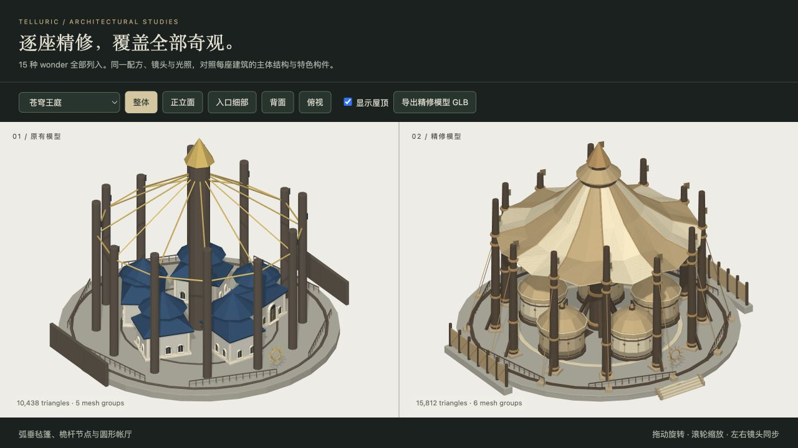
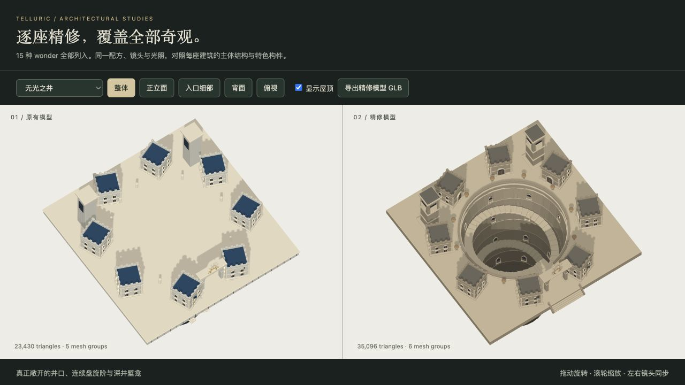
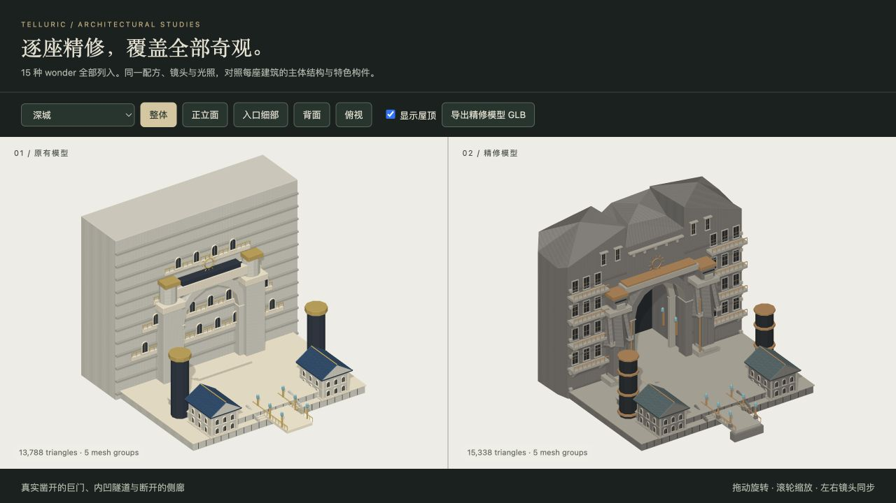
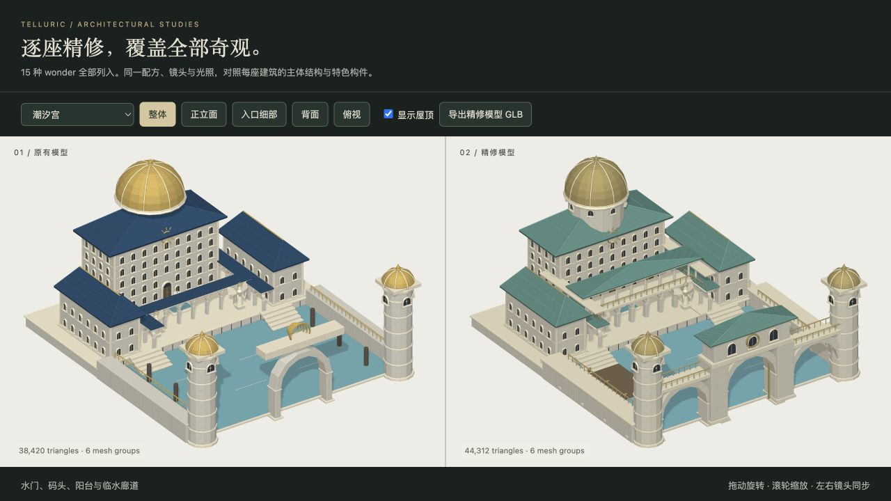

# 全部 15 种 wonder 建筑精修

本轮逐座重做其余 14 种奇观，并把已经在 #31 精修的圣殿一并纳入 15/15 验收。对照基线为 `7264fd6`（#31 合并后）；圣殿两侧相同，表示沿用已完成的精修。

## 逐座改动与实拍

每张截图都来自实际程序化网格，使用相同配方、镜头、光照和城镇细节级别 LOD 1。表中的面数是右侧模型；增加或减少面数都以建筑结构是否清楚、连贯为依据。

| 奇观 | 具体修复 | LOD 1 面数 | 对比图 |
| --- | --- | ---: | --- |
| 圣殿 `cathedral` | 沿用 #31 的深门廊、玫瑰窗、钟楼、飞扶壁与后殿；本轮复查屋顶分组和地块适配 | 185,796 | [查看](../previews/wonders/cathedral.png) |
| 古树圣所 `grove-sanctuary` | 树干收分、分枝承台、分层叶顶、窗间木柱、同层树冠桥和连续绕树阶；移开遮住主厅的树冠 | 23,058 | [查看](../previews/wonders/grove-sanctuary.png) |
| 天穹晶石 `sky-crystal` | 四向台阶、八组带承台和斜撑的支架、银环及仪器廊；保留晶体悬空间隙 | 14,776 | [查看](../previews/wonders/sky-crystal.png) |
| 恐惧堡垒 `dread-keep` | 黑石城堡、深门楼、内嵌闸门、垛口墙道、渐细弯角和完整入口 | 53,038 | [查看](../previews/wonders/dread-keep.png) |
| 深城 `deep-city` | 真实九单位深隧道、避开入口的侧廊、守门雕像；凿岩冠、倒角岩肩、高处凹窗和滴水檐 | 15,338 | [查看](../previews/wonders/deep-city.png) |
| 悬浮塔 `suspended-tower` | 锯齿断口、圈梁、连续悬旋阶、四处落脚平台、到达门廊和上部灯室 | 12,778 | [查看](../previews/wonders/suspended-tower.png) |
| 龙庭 `dragon-court` | 连续弧形厅堂及屋面、内外高窗、两端入口与山墙收口、盘龙门冠；抬出原先被台基掩埋的水池 | 31,636 | [查看](../previews/wonders/dragon-court.png) |
| 熔炉深坑 `forge-hollow` | 封闭挡土环墙、50 级连续下行阶、可见坑底、开放炉口、烟道和吊架 | 16,280 | [查看](../previews/wonders/forge-hollow.png) |
| 镀金王庭 `gilded-palace` | 单层连续金色屋面、承托檐口、双层柱廊和阳台、角亭与屋顶灯亭 | 72,700 | [查看](../previews/wonders/gilded-palace.png) |
| 无光之井 `sunless-well` | 移除堵住井口的实体台板，开放中庭、井壁凹窗与分层腰线，120 级螺旋阶通向深处 | 35,096 | [查看](../previews/wonders/sunless-well.png) |
| 芦苇王座 `reed-throne` | 桩基交叉斜撑、铺板高台、独立木构主厅、编织墙格和方窗、真实入口与有承托的屋顶气楼 | 21,478 | [查看](../previews/wonders/reed-throne.png) |
| 鲸骨议事厅 `whale-moot` | 成对弯曲鲸肋、封闭双面船壳屋顶、外露骨架、议事席位、鲸尾门冠和有支撑的坡道 | 10,302 | [查看](../previews/wonders/whale-moot.png) |
| 苍穹王庭 `sky-court` | 十二瓣弧垂毡篷、束箍桅杆、五座圆帐、牵绳与编织风障，留出中央入口 | 15,812 | [查看](../previews/wonders/sky-court.png) |
| 水上宝塔 `water-pagoda` | 七层厚实曲檐、斗拱与连续塔芯、水台、方池、栏杆和贯通台阶；水面露出基座 | 27,042 | [查看](../previews/wonders/water-pagoda.png) |
| 潮汐宫 `tide-palace` | 从檐口连续承托的穹顶鼓座、双层临水廊、阳台、完整三拱海门、桥廊与码头 | 44,312 | [查看](../previews/wonders/tide-palace.png) |






## 本地查看与模型导出

```sh
npm run build
npm run preview:wonders -- --baseline 7264fd6
npm run test:wonders
npm run dev
```

打开 `/previews/wonders/index.html`。下拉列表包含全部 15 种奇观，可切换整体、正立面、细部、背面与俯视，也可隐藏屋顶；拖动和缩放同步作用于两侧。镜头按两侧实际顶点共同取景，避免宽建筑或高塔被裁掉。原有 `/previews/architecture/` 对比页继续保留。

`npm run assets:wonders` 生成 [15 份完整 GLB 和配套配方](../assets/wonders/manifest.json)。导出的配方使用 `complexity: 2`，默认重新导入后即可重建同一完整细节网格。场景内仍使用 LOD 1，核心形体和建筑特色在这一层已存在。

## 验证与边界

- 注册表与 `TOWN_WONDERS` 的 15 个原生 ID 完全一致，预览和导出逐一覆盖。
- 每座模型检查有限坐标、单位法线、确定性重放、独立几何、面数预算，以及两种旋转下的地块边界与落地位置。
- 结构专项检查实际射线和连续落脚点：井口开洞、480 个螺旋阶采样点、深城隧道、炉坑下行阶、窗梁遮挡、池面露出、塔芯连续、鼓座在三种屋顶坡度下的承托等。
- 全部 15 张截图及界面面数记录保存在 [visual-review.json](../previews/wonders/visual-review.json)。新建模通过原有 `SacredCityKit.miniature` 路径进入城镇，三组构建器进入主页面、单文件构建和几何 worker。
- 世界地形、道路与城镇配方格式没有为奇观改动。地下井坑仍按原有规则整体安置于地块高度，不会挖改真实世界地表。悬浮塔与晶体保留设计中的魔法悬空部分。

完整回归与最终导出检查结果见 [WONDER_VERIFICATION.json](WONDER_VERIFICATION.json)。
