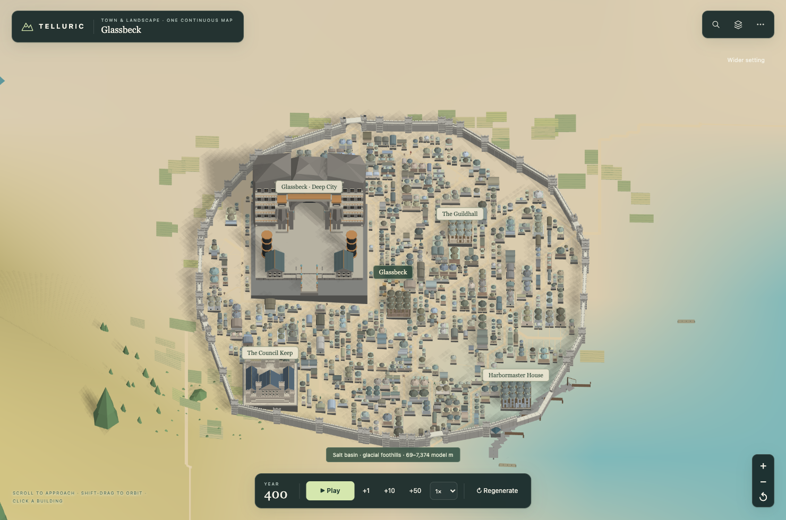
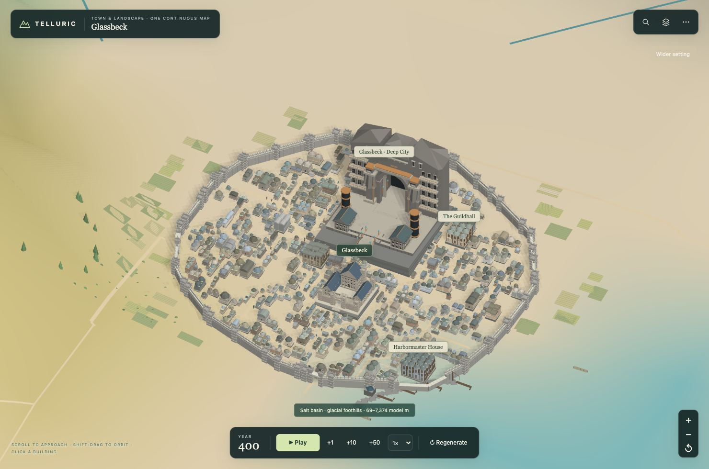
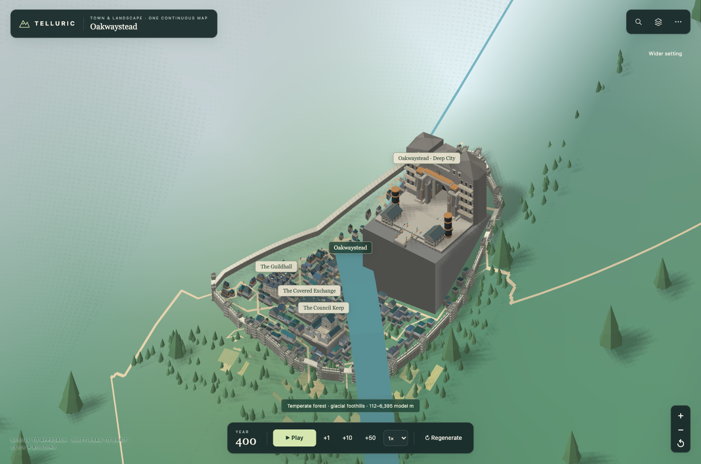
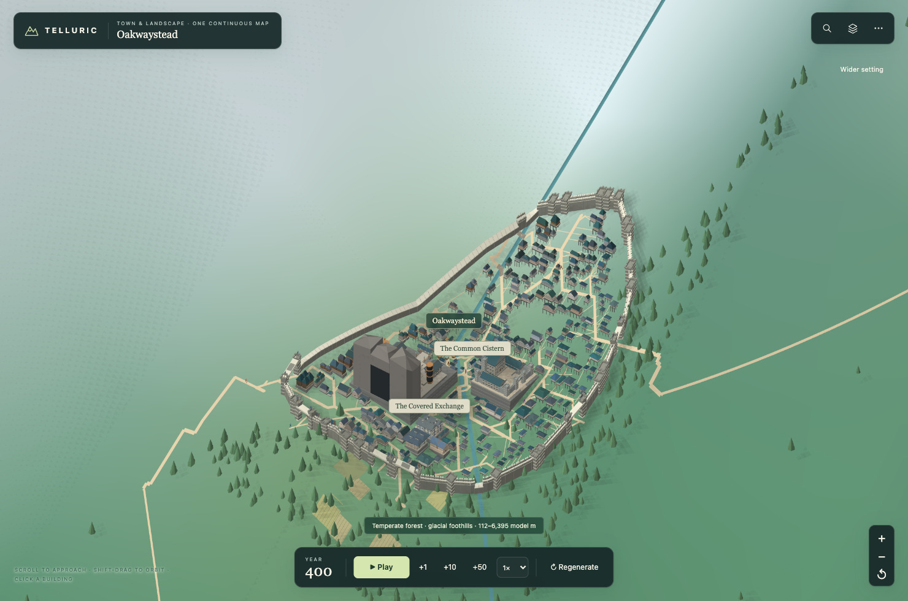
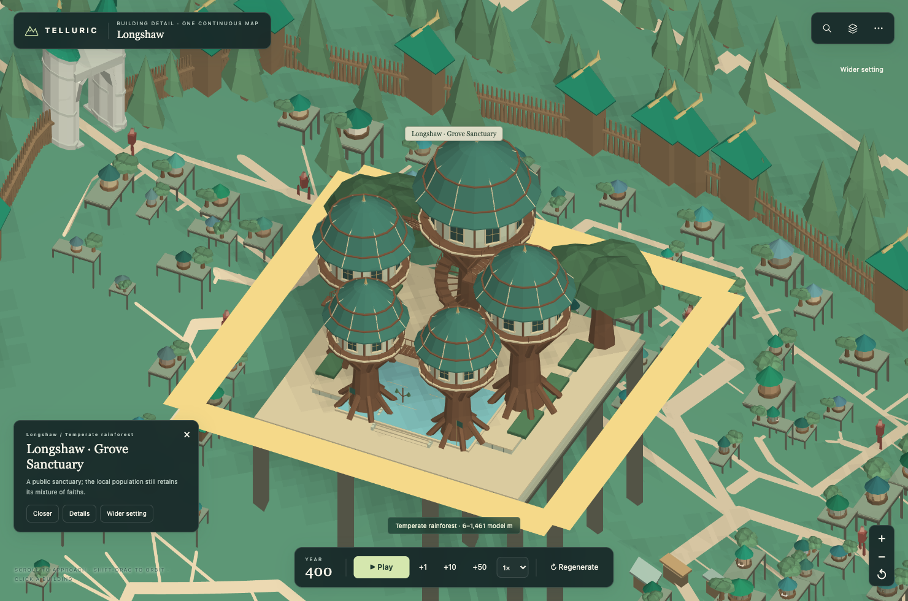

# Civic neighborhoods and building proportions

Opening a city used to reveal council halls pushed against its wall and houses
standing on oversized rectangular plinths. Civic sites now reserve room before
street subdivision, with residential frontage around the precinct. A low,
supported site takes precedence over an isolated high point.

The camera enters at an oblique angle showing two facades. Mountain towns retain
a terrain-aware bearing; a terrain visibility check raises the view when needed.
Building closeups use a lower angle, while underground entrances retain their
steeper view. Cancelled flights and late mesh loads cannot take the camera back
after the user presses Home or starts moving it.

## Geometry

- Building and surface clearance use city units rather than a fixed atlas offset.
  The old building offset alone added about 0.7 units under an ordinary house.
- Deep eaves use the short side of a wing. A long narrow wing no longer forces its
  entire model, including its height, to shrink around an oversized canopy.
- A foundation follows the model's ground contact within the surveyed parcel.
  Low foundations use retaining steps; banks taller than 60% of the actual model
  height use a thin deck, piers and connecting beams, leaving the hillside visible
  between supports. Only support geometry adjusts to the slope; the house,
  windows and roof keep their rigid proportions. Excavated landmarks retain their
  authored openings and underground geometry.
- Oakwaystead's Deep City moved from a 34-unit site spanning about 28 units of
  terrain fall to a 22-unit site spanning 4.76. It no longer needs the enormous
  solid block seen in the previous layout.
- Longshaw exposed a remaining tall-bank case: a stair-shaped solid support was
  still taller than its grove sanctuary. Open piers now replace that support for
  both the sanctuary and its steep residential parcels. Their ground, layout,
  roof heights and model proportions remain the same.

## Layout audit

The fixed default world is Aereth-47 / First-dawn. The comparison baseline is
`bc2f0ca`; the integrated river and vegetation changes do not alter city layouts.
The sample includes the twelve largest cities, the largest city for each remaining
town style, and Glassbeck: 18 cities in total.

| Measure | Before | After |
|---|---:|---:|
| Civic halls retained | 18 | 18 |
| Primary monuments retained | 16 | 16 |
| All civic/temple/academy landmarks | 40 | 40 |
| Civic parcels at the wall buffer | 13 | 0 |
| Civic halls outside residential R80 | 8 | 0 |
| Nearby housing gaps over 150 degrees | 13 | 0 |
| Mean civic distance / residential R80 | 0.962 | 0.419 |
| Residential parcels | 6,743 | 6,604 |

R80 is the radius containing 80% of residential parcel centers, measured from
their mean center. Nearby housing is within 14% of city width from the precinct's
edge. The largest angular gap measures missing housing around a landmark without
depending on the city's compass orientation. These checks prevent making a hall
look central merely by expanding the wall. Shoreline and steep terrain can still
leave naturally open edges.

All 102 default cities were also surveyed: 36,848 buildings, 40–1,034 per city,
with zero water/ice placements, road intersections, parcel overlaps, nonfinite
geometry or sea roads. The world and settlement fingerprints remain unchanged.
Detailed measurements are in [civic-layout-metrics.json](civic-layout-metrics.json).
Downhill foundation ratios in that file measure the full terrain fall, including
buried support; they are not the height of a solid wall in the final geometry.

## Reproduction

Validation on this change included a 273-test full regression sweep, followed by
121 affected integration checks after the final support and upstream vegetation
changes. The sweep exposed an upstream renderer hash that #37 has since updated,
and an absolute 30-unit sanctuary-width assertion; the sanctuary check now asserts
real monumental size against nearby houses and the reserved parcel. Both were
rechecked successfully. The final integration run passed 120 checks immediately;
the remaining tree test pinned the old street layout. It now compares the original
inline tree-height formula against the extracted helper under the same current
layout, and its complete six-test file passes. No production regression remains
from these runs. The final browser run passes for all five sampled cities.

Run `npm run build`, then the Node test suite. The added civic layout, building
footing and camera focus tests cover residential surroundings, reserved blocks,
rigid architecture, stepped support and asynchronous camera cancellation. The
fortification fallback has a deterministic narrow-lane fixture, since the improved
Scorchspire street network no longer needs that fallback.

`npm run test:civic-browser` runs the standalone HTML in an isolated Chromium
profile. `PLAYWRIGHT_MODULE` and `CHROMIUM_PATH` can select existing installations.
It exercises actual search entry, house selection, palace closeup, orbit, mobile
size and an underground entrance, and records page errors and network requests in
[the browser results](../previews/civic-layout/after/results.json).

## Screenshots

Glassbeck before (previous default entry angle):

Glassbeck after:

Oakwaystead's old layout with the same oblique camera used for the geometry check:

Oakwaystead after:

Longshaw's steep sanctuary now uses open support:

