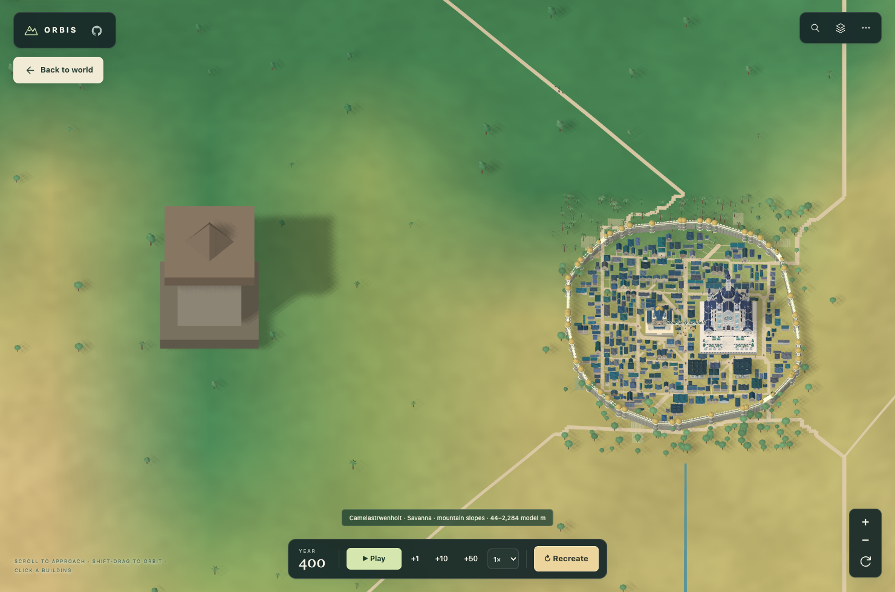
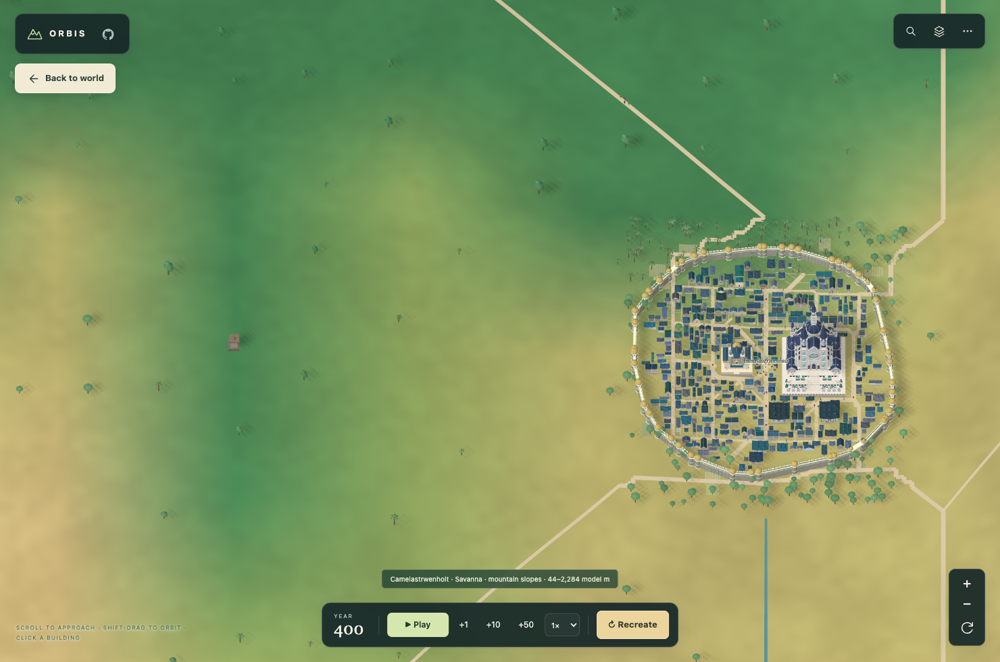

# Frontier watchtower scale

The comparison uses the same camera, Camelastrwenholt (province 313), and border crossing at grid coordinate (238, 83) in the default Aereth-47 world. The city contains 342 buildings in both views.

Before: the enlarged atlas marker remained beside the actual town.

After: the watchtower uses the same physical units as town architecture.

`after-physical-close.png` is a separate zoom-600 inspection of the small tower and its footing. `verification.json` records dimensions, zoom checks, and matching world, settlement and political fingerprints.

Run `node tests/frontier-posts.browser.mjs` after `npm run build`. Set `PLAYWRIGHT_MODULE` and `CHROMIUM_PATH` if using an existing Playwright/Chromium installation. The optional `--before` flag reads an earlier build saved as `before.html` inside `ORBIS_FRONTIER_OUTPUT` (default `/tmp/orbis-frontier-browser`).
